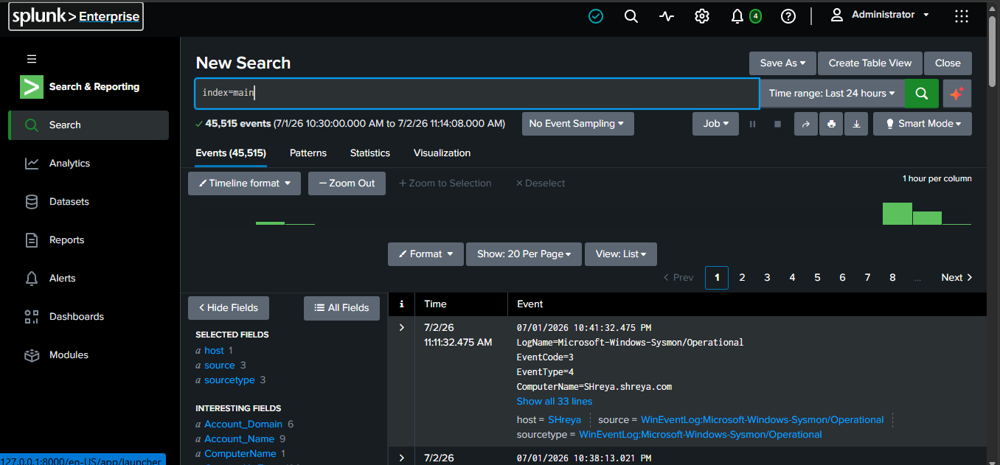
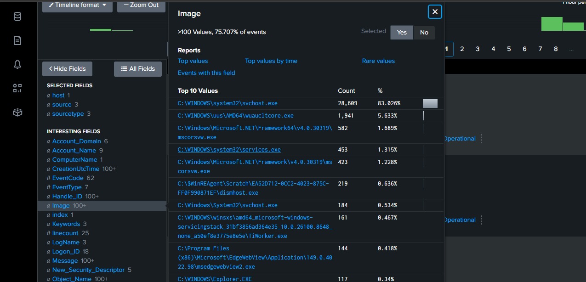
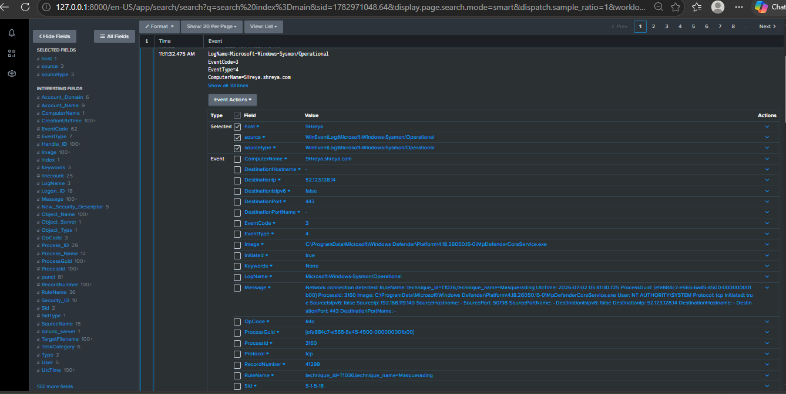
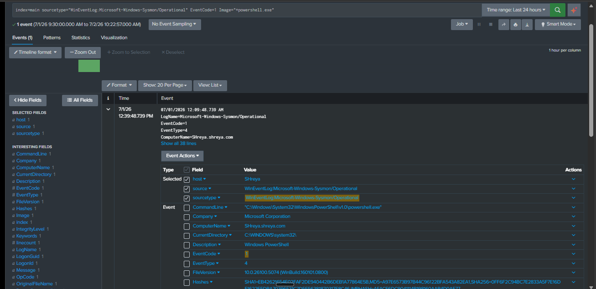
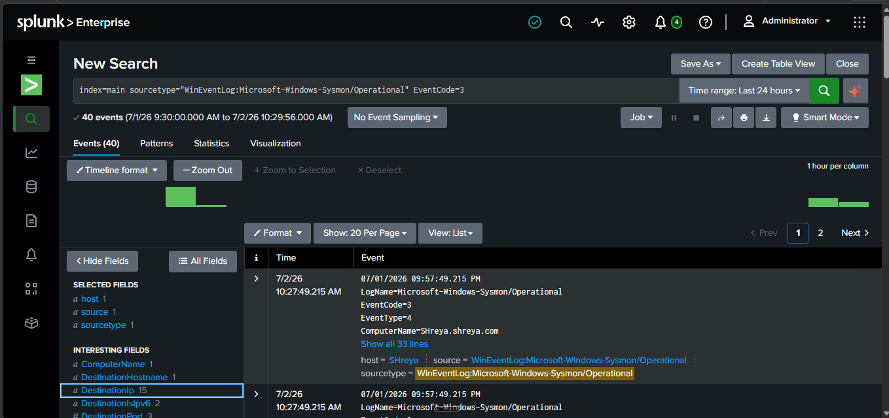
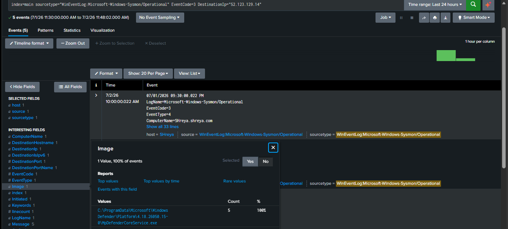
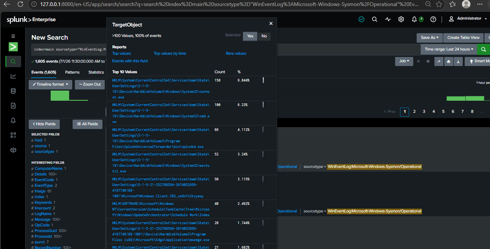
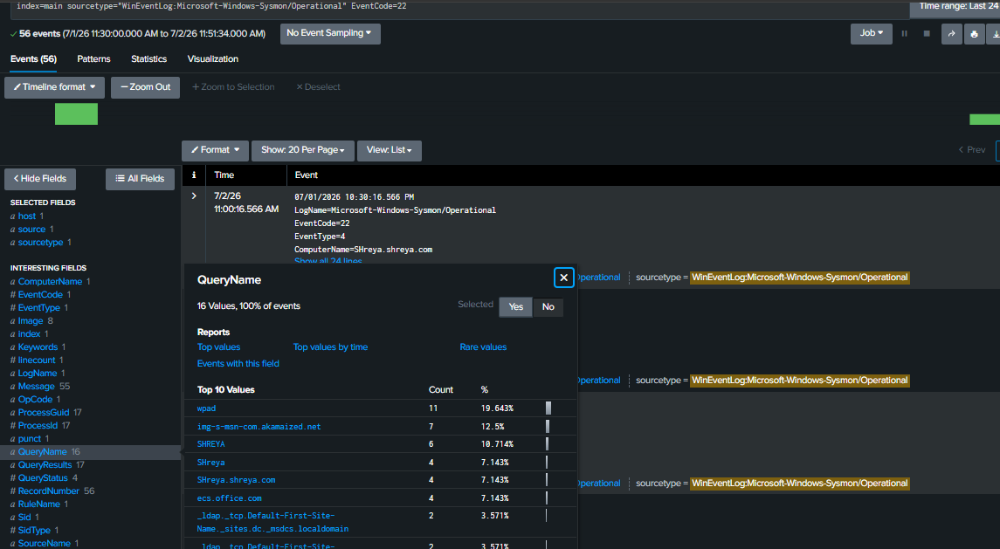
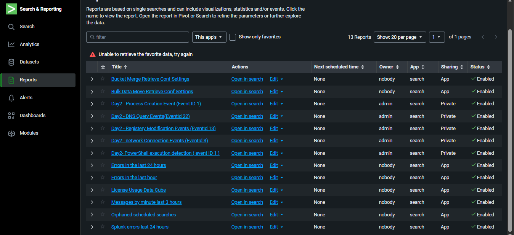

<details>
<summary><b>📅 Day 2 — SPL Basics + Sysmon Event ID Analysis</b></summary>

<br>

### 🎯 Objective
Learn Splunk's Search Processing Language (SPL), understand the 7 most critical Sysmon Event IDs used in real SOC environments, write 5 real detection searches against live Sysmon data, and develop the analyst mindset of distinguishing legitimate activity from malicious behavior.

---

### 🧠 Key Sysmon Event IDs Reference Table

> This table is the foundation of every detection rule written in this project. Every SOC analyst must know these Event IDs by heart — they are the universal language of Windows endpoint detection.

| Event ID | Name | What it records | Attack example | Legitimate example |
|----------|------|----------------|----------------|--------------------|
| **1** | Process Creation | Every program that runs — its name, path, arguments, parent process, and user | Attacker runs `powershell.exe -EncodedCommand ...` to execute hidden malicious code | User opens `notepad.exe` from desktop |
| **3** | Network Connection | Every outbound network connection — destination IP, port, and which process made it | Malware connects to `192.168.x.x:4444` (Metasploit default C2 port) | Browser connects to `142.250.x.x:443` (Google HTTPS) |
| **7** | Image Loaded | Every DLL file loaded by a process | Attacker loads a malicious DLL from `C:\Users\Downloads\evil.dll` via DLL hijacking | System loads `C:\Windows\System32\ntdll.dll` at Windows startup |
| **8** | CreateRemoteThread | One process injecting code into another process | Attacker injects shellcode into `explorer.exe` to hide malware inside a trusted process | Legitimate debuggers or AV software inspecting processes |
| **11** | File Created | Every new file written to disk | Malware drops `payload.exe` into `C:\Users\Public` or `C:\Temp` | User saves a Word document to Desktop |
| **12/13** | Registry Modified | Every change to the Windows registry | Attacker adds malware path to `HKLM\...\CurrentVersion\Run` so it starts on every reboot | Windows Update modifies a system registry key |
| **22** | DNS Query | Every domain name lookup made by any process | Malware queries `a7f3kx92.ru` — a randomly generated C2 domain (DGA) | Browser queries `google.com` for a search |

---

### 🔍 SPL Search 1 — All Sysmon Events Overview

**SPL Query:**
```
index=main sourcetype="WinEventLog:Microsoft-Windows-Sysmon/Operational"
```

**Time range:** Last 24 hours

**Result:** 4,159 total Sysmon events

**What this search does:**
This is the broadest possible Sysmon search — it returns every single event Sysmon recorded across all Event IDs. In a real SOC, you would never run this on a production environment (millions of events would return), but in a lab it gives a complete picture of all endpoint activity.

**Key fields visible in results:**

| Field | What it means |
|-------|--------------|
| `EventCode` | The Sysmon Event ID number (1, 3, 7, 8, 11, 13, 22 etc.) |
| `Image` | Full path of the program involved |
| `ComputerName` | Which machine generated this event (Shreya.shreya.com) |
| `User` | Which user account was associated with the activity |
| `CreationUtcTime` | Exact timestamp of the event |

**Interesting Fields observed:**
- **EventCode** — 14 unique values detected (14 different types of Sysmon events active)
- **Image** — 98 unique process images (98 different programs recorded)
- **ComputerName** — 1 value (Shreya.shreya.com — our Windows 11 VM)

<details>
<summary>📸 Screenshots — SPL Search 1</summary>
<br>

**Screenshot 1 — 4,159 total Sysmon events in Splunk**
> Splunk Search & Reporting showing 4,159 total events returned for the broad Sysmon index query. The count increased from Day 1's 3,700 because Sysmon continued recording overnight while the VM remained powered on — confirming the pipeline is running continuously and automatically without any manual intervention.



</details>

---

### 🔍 SPL Search 2 — Process Creation Events (Event ID 1)

**SPL Query:**
```
index=main sourcetype="WinEventLog:Microsoft-Windows-Sysmon/Operational" EventCode=1
```

**Time range:** Last 24 hours

**Result:** 164 process creation events across 23 unique processes

**What this search does:**
Filters Sysmon logs to show only Event ID 1 — every program that was launched on the Windows 11 VM. This is the single most important Event ID in endpoint detection because attackers must run programs to do anything on a compromised system.

**Top processes observed and analysis:**

| Process | Count | Path | Legitimate or Suspicious? |
|---------|-------|------|--------------------------|
| `svchost.exe` | 68 (41.4%) | `C:\Windows\System32\svchost.exe` | ✅ Legitimate — Windows service host, runs dozens of background services normally |
| `wevtutil.exe` | 26 (15.8%) | `C:\Windows\System32\wevtutil.exe` | ⚠️ Context-dependent — Windows event log utility. Legitimate when run by SYSTEM. Suspicious if run by a user account — attackers use it to clear event logs and destroy evidence |
| `WmiPrvSE.exe` | 18 (10.9%) | `C:\Windows\System32\wbem\WmiPrvSE.exe` | ✅ Legitimate — Windows Management Instrumentation provider, normal background service |
| `msedgewebview2.exe` | 8 (4.8%) | `C:\Program Files (x86)\Microsoft\EdgeWebView` | ✅ Legitimate — Microsoft Edge WebView component used by Windows widgets |
| `rundll32.exe` | 8 (4.8%) | `C:\Windows\System32\rundll32.exe` | ⚠️ Context-dependent — used to execute DLL files. Legitimate when spawned by Windows. Highly suspicious if CommandLine contains unusual DLL paths or encoded arguments |
| `sc.exe` | 7 (4.2%) | `C:\Windows\System32\sc.exe` | ⚠️ Context-dependent — Windows service control tool. Attackers use it to install malicious services for persistence |
| `csrss.exe` | 4 (2.4%) | `C:\Windows\System32\csrss.exe` | ✅ Legitimate — Client Server Runtime Process, core Windows process |
| `Notepad.exe` | 2 (1.2%) | `C:\Program Files\WindowsApps\...Notepad.exe` | ✅ Legitimate — opened manually during Day 1 configuration file editing |

**How to determine if a process is malicious — the 3-factor check:**

> A process is NOT suspicious just because of its name. `cmd.exe` running legitimately is fine. The same `cmd.exe` becomes a red flag when the combination of these 3 factors tells a suspicious story:

1. **WHERE did it run from?** — `svchost.exe` from `C:\Windows\System32` is normal. `svchost.exe` from `C:\Users\Downloads` is an attacker disguising malware as a Windows process (masquerading — MITRE T1036)
2. **WHAT launched it (ParentImage)?** — `cmd.exe` launched by `explorer.exe` (desktop) is normal. `cmd.exe` launched by `winword.exe` (Microsoft Word) means a Word document macro is executing commands — a classic phishing attack
3. **WHAT arguments did it run with (CommandLine)?** — `powershell.exe` with no arguments is normal. `powershell.exe -ExecutionPolicy Bypass -WindowStyle Hidden -EncodedCommand SQBFAFgA...` is an attacker hiding malicious commands in base64 encoding

**Real event analyzed — Event ID 1:**

| Field | Value | Analysis |
|-------|-------|----------|
| Image | `C:\Windows\System32\wbem\WmiPrvSE.exe` | Legitimate Windows process |
| ParentImage | `C:\Windows\System32\svchost.exe` | Normal parent — svchost starts WMI service |
| CommandLine | `wmiprvse.exe -secured -embedding` | Normal WMI arguments, no suspicious flags |
| User | `NT AUTHORITY\SYSTEM` | Windows itself running this, not a user or attacker |
| **Verdict** | **✅ Clean** | Normal Windows background activity |

<details>
<summary>📸 Screenshots — SPL Search 2</summary>
<br>

**Screenshot 2 — Image field popup showing top 10 processes**
> Splunk's Image field analysis showing 23 unique processes recorded across all Event ID 1 events. The top process is `svchost.exe` with 68 occurrences (41.4%) — completely normal as it is the primary Windows service host. All top processes originate from `C:\Windows\System32` — a strong indicator of legitimacy since malware commonly runs from user directories like Downloads or Temp.



---

**Screenshot 3 — Fully expanded Event ID 1 event**
> A single Event ID 1 event expanded in Splunk showing all key fields: Image (WmiPrvSE.exe), ParentImage (svchost.exe), CommandLine (-secured -embedding arguments), and User (NT AUTHORITY\SYSTEM). Reading these 4 fields together confirms this is legitimate Windows background activity — normal parent-child relationship, normal arguments, system-level user.



</details>

---

### 🔍 SPL Search 3 — PowerShell Execution Detection (Event ID 1 filtered)

**SPL Query:**
```
index=main sourcetype="WinEventLog:Microsoft-Windows-Sysmon/Operational" EventCode=1 Image="*powershell.exe"
```

**Time range:** Last 24 hours

**Result:** 1 event

**What this search does:**
Specifically hunts for PowerShell executions within all process creation events. PowerShell is the most commonly abused tool by attackers on Windows because it is powerful, built into every Windows machine, and can download files, execute code in memory, bypass security tools, and communicate with remote servers — all without touching the disk.

**The `*` wildcard explained:**
`Image="*powershell.exe"` means "match any Image field that ends with powershell.exe regardless of the folder path." This catches both `C:\Windows\System32\WindowsPowerShell\v1.0\powershell.exe` and any attacker trying to run a renamed or relocated copy.

**PowerShell event analyzed:**

| Field | Value | Analysis |
|-------|-------|----------|
| Image | `C:\Windows\System32\WindowsPowerShell\v1.0\powershell.exe` | Correct legitimate path ✅ |
| ParentImage | `C:\Windows\explorer.exe` | Opened manually from Start menu or desktop ✅ |
| CommandLine | `powershell.exe` (no additional arguments) | No hidden flags, no encoded commands ✅ |
| User | `SHREYA\shreya` | Lab owner ran this manually during Day 1 setup ✅ |
| **Verdict** | **✅ Clean — analyst ran this manually during Day 1 Test-NetConnection step** | |

**What malicious PowerShell looks like vs what we found:**

| Indicator | Our event (Clean) | Malicious PowerShell |
|-----------|-------------------|---------------------|
| ParentImage | `explorer.exe` (desktop) | `winword.exe`, `excel.exe`, `wscript.exe` |
| CommandLine | No extra arguments | `-ExecutionPolicy Bypass -WindowStyle Hidden -EncodedCommand SQBFAFgA...` |
| Path | `C:\Windows\System32\WindowsPowerShell\v1.0\` | `C:\Users\Downloads\` or `C:\Temp\` |
| User | Known lab user | Unknown user or `NT AUTHORITY\SYSTEM` unexpectedly |

**Why `-EncodedCommand` is a massive red flag:**
Attackers encode their PowerShell commands in Base64 to bypass security tools that scan command lines for keywords like "download," "invoke," or "http." If you ever see `-EncodedCommand` or `-enc` in a CommandLine field, treat it as high priority alert immediately.

<details>
<summary>📸 Screenshots — SPL Search 3</summary>
<br>

**Screenshot 4 — PowerShell Event ID 1 search result**
> Single PowerShell execution event returned — this was the analyst manually opening PowerShell during Day 1 setup to run the Test-NetConnection command. The clean ParentImage (explorer.exe), absence of encoded arguments in CommandLine, and known user (SHREYA\shreya) all confirm this is legitimate activity. In a real SOC environment, even this single PowerShell event would be logged, reviewed, and closed as a false positive with these exact justifications documented.



</details>

---

### 🔍 SPL Search 4 — Network Connection Events + External IP Investigation (Event ID 3)

**SPL Query (broad):**
```
index=main sourcetype="WinEventLog:Microsoft-Windows-Sysmon/Operational" EventCode=3
```

**SPL Query (targeted investigation):**
```
index=main sourcetype="WinEventLog:Microsoft-Windows-Sysmon/Operational" EventCode=3 DestinationIp="52.123.119.14"
```

**Time range:** Last 24 hours

**Result:** 40 total network connection events

**What this search does:**
Event ID 3 records every outbound network connection made by any process on the endpoint — destination IP, destination port, source port, protocol, and the process that initiated the connection. This is how SOC analysts detect malware "calling home" to an attacker's Command and Control (C2) server.

**Top destination IPs observed and analysis:**

| Destination IP | Count | Type | Analysis |
|---------------|-------|------|----------|
| `192.168.119.1` | 7 (21%) | Internal — VMnet8 host gateway | ✅ Legitimate — Universal Forwarder sending Sysmon logs to Splunk on host machine |
| `fe80::8769:8556:d93f` | 6 (18%) | IPv6 link-local | ✅ Legitimate — automatic Windows local network communication, no internet involved |
| `52.123.119.14` | 5 (15%) | External internet IP | ⚠️ Investigated — external IP requires identification |

**Investigation of external IP `52.123.119.14`:**

Filtered specifically for this IP and found:

| Field | Value | Analysis |
|-------|-------|----------|
| Image | `C:\ProgramData\Microsoft\Windows Defender\Platform\4.18.26050.15-0\MpDefenderCoreService.exe` | Microsoft Defender Antivirus core service |
| DestinationPort | `443` | HTTPS — standard encrypted web traffic |
| Count | 5 connections | Defender checking for updates periodically |
| IP Owner | Microsoft Azure cloud infrastructure | Confirmed Microsoft-owned IP range |
| **Verdict** | **✅ Clean — Microsoft Defender downloading virus definition updates** | |

**SOC workflow demonstrated — the 4-step investigation process:**
1. **Detected** — Found external IP `52.123.119.14` in network connection logs
2. **Investigated** — Filtered Splunk specifically for that IP
3. **Analyzed** — Identified process (Defender), port (443/HTTPS), and IP owner (Microsoft Azure)
4. **Closed** — Confirmed false positive, documented justification

**What malicious network connections look like vs what we found:**

| Indicator | Our event (Clean) | Malicious connection |
|-----------|-------------------|---------------------|
| Process | `MpDefenderCoreService.exe` (known AV) | `cmd.exe`, `powershell.exe`, `rundll32.exe` making network connections |
| Port | 443 (standard HTTPS) | 4444 (Metasploit default), 1337, unusual high ports |
| IP | Microsoft Azure (known vendor) | Unknown IP, especially from Russia (.ru), China (.cn) |
| Frequency | Periodic (update schedule) | Beaconing — connections every X seconds/minutes like clockwork |

**What is C2 beaconing:**
Malware on a compromised machine contacts its attacker's server at regular intervals (e.g., every 60 seconds) to receive instructions. In Splunk, this appears as the same external IP being contacted by the same process repeatedly at suspiciously regular time intervals. This is one of the most important patterns to detect using Event ID 3.

<details>
<summary>📸 Screenshots — SPL Search 4</summary>
<br>

**Screenshot 5 — Event ID 3 DestinationIp field showing top IPs**
> Network connection events showing top destination IPs. The top external IP (52.123.119.14) was immediately flagged for investigation because it is not a private/internal IP address. In a SOC environment, any process making unexpected external connections is investigated before being cleared.



---

**Screenshot 6 — Filtered search for 52.123.119.14 showing Defender**
> Targeted search for the external IP showing 5 connections all made by MpDefenderCoreService.exe (Microsoft Defender) to port 443 (HTTPS). This confirms the connection is Microsoft Defender's cloud protection and update service — a false positive. Documenting why something is NOT malicious is equally important SOC work as finding real threats.



</details>

---

### 🔍 SPL Search 5 — Registry Modification Events (Event ID 13)

**SPL Query:**
```
index=main sourcetype="WinEventLog:Microsoft-Windows-Sysmon/Operational" EventCode=13
```

**Time range:** Last 24 hours

**Result:** 1,382 registry modification events

**What this search does:**
Event ID 13 records every time a value is written to the Windows registry. The Windows registry is a massive database that controls almost everything about how Windows and its applications behave — startup programs, user settings, service configurations, security policies. This is why it is a prime target for attackers establishing **persistence**.

**Top registry keys modified and analysis:**

| TargetObject (Registry Key) | Count | Analysis |
|----------------------------|-------|----------|
| `HKLM\System\CurrentControlSet\Services\bam\State\UserSettings\...\conhost.exe` | 125 (9%) | ✅ Legitimate — BAM (Background Activity Moderator) tracking that conhost.exe ran. Windows writes this automatically |
| `HKLM\System\CurrentControlSet\Services\bam\State\UserSettings\...\cmd.exe` | 96 (6.9%) | ✅ Legitimate — BAM tracking cmd.exe executions from Day 1 setup commands |
| `HKLM\System\CurrentControlSet\Services\bam\State\UserSettings\...\splunkd.exe` | 66 (4.7%) | ✅ Legitimate — BAM tracking Splunk Forwarder service running continuously |

**Understanding BAM (Background Activity Moderator):**
`HKLM\System\CurrentControlSet\Services\bam\` is NOT a persistence key — it is Windows' own internal tracking system that records program execution history for power management purposes. Windows writes to it automatically every time any program runs. It is similar to a history log kept by Windows itself.

**Critical registry keys that ARE used for persistence (what attackers target):**

| Registry Key | Why attackers use it | Severity |
|-------------|---------------------|----------|
| `HKLM\Software\Microsoft\Windows\CurrentVersion\Run` | Any program listed here starts automatically for ALL users on every boot | 🔴 Critical |
| `HKCU\Software\Microsoft\Windows\CurrentVersion\Run` | Same as above but for current user only | 🔴 Critical |
| `HKLM\Software\Microsoft\Windows NT\CurrentVersion\Winlogon` | Programs run at Windows login | 🔴 Critical |
| `HKLM\System\CurrentControlSet\Services\` | Attacker installs malware as a Windows service | 🔴 Critical |
| `HKLM\...\bam\...` | Windows tracking only — NOT persistence | ✅ Normal |

**None of the persistence keys were touched in our lab data — all 1,382 modifications are normal BAM tracking activity.**

> In Day 3 and Day 4, when we run Atomic Red Team attack simulations, we will deliberately trigger writes to the persistence keys above and write SPL rules to detect them in real time.

<details>
<summary>📸 Screenshots — SPL Search 5</summary>
<br>

**Screenshot 7 — Event ID 13 TargetObject field showing top registry keys**
> Registry modification events showing 1,382 total events. All top modified keys belong to the BAM (Background Activity Moderator) hive — a Windows-internal tracking system that records program execution history. The three most modified entries correspond directly to programs we used during Day 1 setup: conhost.exe (Command Prompt sessions), cmd.exe (net stop/start commands), and splunkd.exe (Universal Forwarder running continuously). All confirmed legitimate.



</details>

---

### 🔍 SPL Search 6 — DNS Query Events (Event ID 22)

**SPL Query:**
```
index=main sourcetype="WinEventLog:Microsoft-Windows-Sysmon/Operational" EventCode=22
```

**Time range:** Last 24 hours

**Result:** 56 DNS query events

**What this search does:**
Event ID 22 records every DNS (Domain Name System) lookup made by any process on the endpoint. Before any program can connect to a server using a domain name (like `google.com`), it must first query DNS to convert that name into an IP address. This makes DNS queries a critical detection point — malware must query its C2 domain before it can connect to it, and that query will appear in Event ID 22 logs before any network connection occurs.

**Top DNS queries observed and analysis:**

| Domain Queried | Count | Analysis |
|---------------|-------|----------|
| `wpad` | 11 (19.6%) | ✅ Legitimate — Web Proxy Auto-Discovery, automatic Windows behavior to find network proxy settings. Note: WPAD can be abused by attackers for MITM attacks on local networks, but here it is normal background Windows behavior |
| `img-s-msn-com.akamaized.net` | 7 (12.5%) | ✅ Legitimate — Microsoft/MSN image content delivery network. Windows widgets or Edge loading MSN news images in background |
| `SHREYA` | 6 (10.7%) | ✅ Legitimate — VM resolving its own hostname on the network, common Active Directory behavior |
| `SHreya` | 4 (7.1%) | ✅ Legitimate — Same hostname resolution, case variation due to Windows DNS query behavior |
| `SHreya.shreya.com` | 4 (7.1%) | ✅ Legitimate — VM resolving its fully qualified domain name (FQDN) within the Active Directory domain |

**All 56 DNS queries confirmed legitimate — zero malicious domains detected.**

**What malicious DNS activity looks like vs what we found:**

| Indicator | Our events (Clean) | Malicious DNS |
|-----------|-------------------|---------------|
| Domain pattern | Known Microsoft domains, own hostname | Random-looking: `a7f3kx92.ru`, `xk29fmq.top` |
| TLD (domain ending) | `.net`, `.com`, or internal hostname | `.ru`, `.cn`, `.top`, `.tk`, `.xyz` (high-risk TLDs) |
| Subdomain length | Normal length | Extremely long subdomains: `verylongbase64encodeddata.c2server.com` |
| Query frequency | Periodic, normal intervals | Hundreds of queries per minute (DGA malware) |
| Querying process | `svchost.exe`, `msedge.exe` | `cmd.exe`, `powershell.exe`, `rundll32.exe` making DNS queries |

**Two advanced DNS attack patterns to know:**

**1. DGA (Domain Generation Algorithm):**
Malware automatically generates hundreds of random domain names daily using an algorithm. It tries to connect to each one until it finds the one the attacker registered that day. This makes C2 infrastructure very hard to block. In Splunk, this appears as a single process making massive numbers of DNS queries to random-looking domains in a short time window.

**2. DNS Tunneling:**
Attackers encode stolen data or C2 commands inside DNS query strings themselves — e.g., `c3RvbGVuZGF0YQ.attacker.com`. The DNS server is attacker-controlled and decodes the data. This bypasses most firewalls because DNS traffic is rarely blocked. In Splunk, this appears as unusually long subdomain strings or abnormally high DNS query volume from a single process.

> In Day 3 and Day 4, we will simulate these attack patterns using Atomic Red Team and write SPL rules to detect both DGA behavior and DNS tunneling indicators in real time.

<details>
<summary>📸 Screenshots — SPL Search 6</summary>
<br>

**Screenshot 8 — Event ID 22 QueryName field showing top 5 domains**
> DNS query events showing 56 total lookups with top 5 domains analyzed. All domains confirmed legitimate: Microsoft CDN (MSN images), Windows WPAD auto-discovery, and the VM's own Active Directory hostname resolution. Zero suspicious domains detected. In a real SOC environment, this baseline of normal DNS activity is documented so that any new or unusual domain query stands out immediately as an anomaly.



</details>

---

### 💾 Saved SPL Reports in Splunk

All 5 searches were saved as permanent named reports in Splunk for reuse throughout this project:

| Report Name | Event ID | Purpose |
|-------------|----------|---------|
| `Day2 - Process Creation Events (EventID 1)` | 1 | Baseline all process executions |
| `Day2 - PowerShell Execution Detection (EventID 1)` | 1 | Hunt specifically for PowerShell activity |
| `Day2 - Network Connection Events (EventID 3)` | 3 | Monitor all outbound network connections |
| `Day2 - Registry Modification Events (EventID 13)` | 13 | Track all registry changes |
| `Day2 - DNS Query Events (EventID 22)` | 22 | Monitor all domain name lookups |

<details>
<summary>📸 Screenshots — Saved Reports</summary>
<br>

**Screenshot 9 — Splunk Reports page showing all 5 saved Day 2 reports**
> Splunk Reports section showing all 5 named detection searches saved from Day 2 analysis. These reports serve as reusable building blocks — in Day 4 and Day 5 they will be converted into active Splunk Alerts that automatically trigger when attack patterns are detected in incoming Sysmon data.



</details>

---

### ✅ Day 2 Summary

| Activity | Result | Status |
|----------|--------|--------|
| Verified pipeline still running | 4,159 events flowing (up from 3,700) | ✅ |
| Learned 7 critical Sysmon Event IDs | All documented with attack vs legitimate examples | ✅ |
| SPL Search 1 — All events overview | 4,159 events, 14 Event ID types, 98 unique processes | ✅ |
| SPL Search 2 — Process Creation (EventID 1) | 164 events, all processes analyzed and verified clean | ✅ |
| SPL Search 3 — PowerShell detection | 1 event — confirmed analyst's own Day 1 activity | ✅ |
| SPL Search 4 — Network connections (EventID 3) | 40 events — external IP investigated, confirmed Microsoft Defender update traffic | ✅ |
| SPL Search 5 — Registry modifications (EventID 13) | 1,382 events — all BAM tracking, no persistence keys touched | ✅ |
| SPL Search 6 — DNS queries (EventID 22) | 56 events — all Microsoft/Windows domains, zero suspicious domains | ✅ |
| All searches saved as Splunk Reports | 5 named reports saved for reuse | ✅ |

**Key analyst skill developed today:** Reading the combination of Image + ParentImage + CommandLine + User together to determine if an event is legitimate or malicious — not just looking at process names in isolation.

**What changes from Day 3 onwards:** Today all activity was clean because nothing attacked the VM yet. From Day 3, we install Atomic Red Team and deliberately simulate real ATT&CK techniques — the same searches above will start returning genuinely malicious-looking events that we will write detection rules to catch.

</details>
