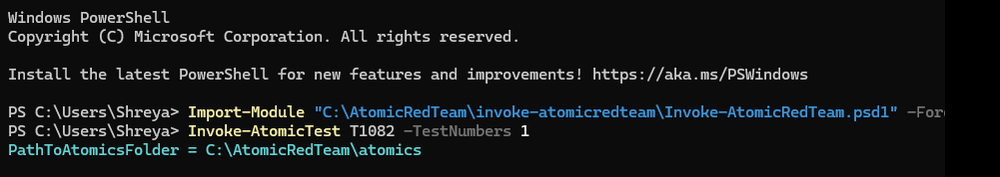
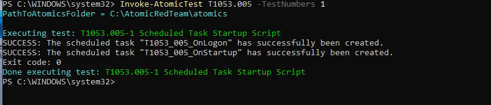
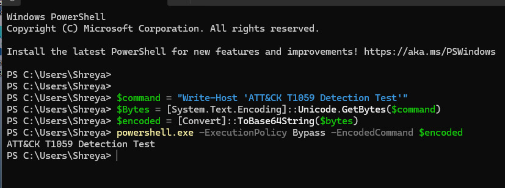
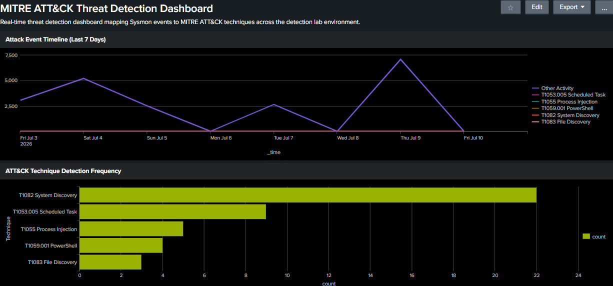
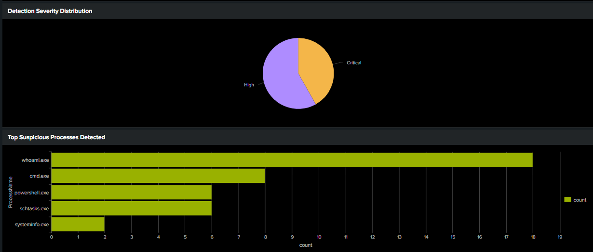
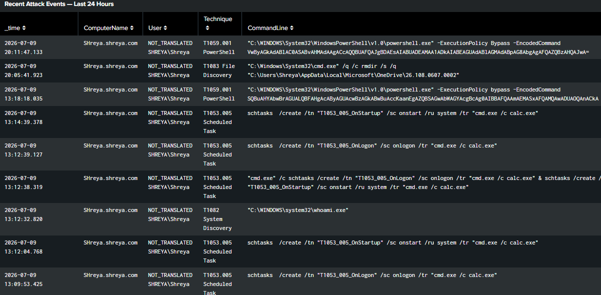
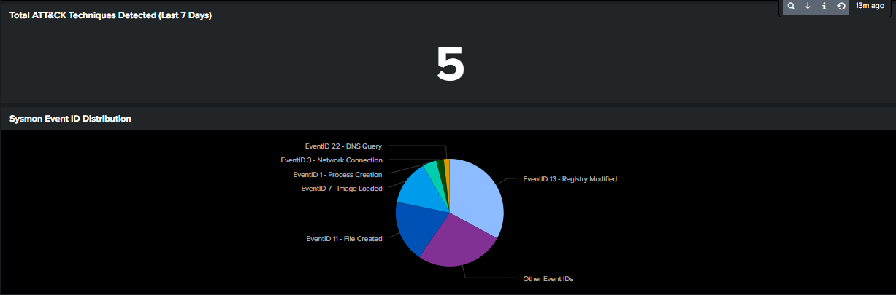
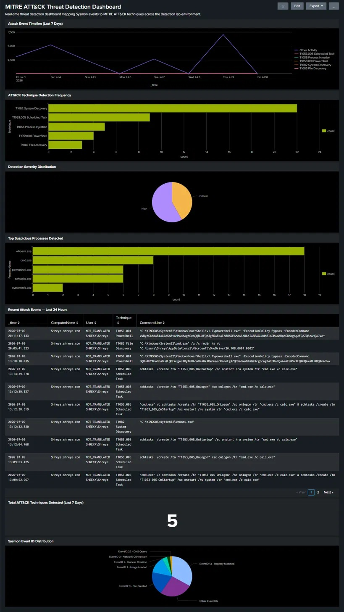

<details>
<summary><b>📅 Day 6 — Splunk Threat Detection Dashboard</b></summary>

<br>

### 🎯 Objective
Build a professional real-time threat detection dashboard in Splunk that consolidates all 7 ATT&CK detection rules into a single visual monitoring interface. The dashboard provides a SOC analyst with an immediate, at-a-glance view of all attack activity — timeline, technique frequency, severity distribution, suspicious processes, live event table, and Sysmon event coverage — without needing to run individual searches manually.

---

### 🧠 Why Dashboards Matter in a Real SOC

In enterprise SOC environments, analysts monitor dashboards continuously across multiple screens. A well-designed dashboard answers the most critical questions instantly:

| Question | Dashboard panel that answers it |
|----------|--------------------------------|
| Is there active attack activity right now? | Panel 1 — Attack Event Timeline |
| Which ATT&CK technique is firing most? | Panel 2 — Technique Detection Frequency |
| How severe is the current threat? | Panel 3 — Severity Distribution |
| Which processes are behaving suspiciously? | Panel 4 — Top Suspicious Processes |
| What exactly happened in the last 24 hours? | Panel 5 — Recent Attack Events Table |
| How many unique techniques have we detected? | Panel 6 — Total Techniques Counter |
| Are all Sysmon event types being collected? | Panel 7 — Event ID Distribution |

**Without a dashboard:** An analyst must manually run 7 different SPL searches to get the same picture — taking 10-15 minutes every time they want a status update.

**With this dashboard:** Every answer is visible in under 3 seconds — the moment the page loads.

---

### 🔧 Dashboard Setup

**Dashboard created in Splunk Enterprise:**
- Navigate to: Dashboards → Create New Dashboard
- Title: `MITRE ATT&CK Threat Detection Dashboard`
- Description: `Real-time threat detection dashboard mapping Sysmon events to MITRE ATT&CK techniques across the detection lab environment`
- Type: Classic Dashboard
- Theme: Dark

**Fresh attack data generated before dashboard build:**
Three attack simulations were run immediately before building the dashboard to ensure all panels had live, current data to display:

**Simulation 1 — T1082 System Discovery:**
```powershell
Import-Module "C:\AtomicRedTeam\invoke-atomicredteam\Invoke-AtomicRedTeam.psd1" -Force
Invoke-AtomicTest T1082 -TestNumbers 1
```
Output: `Done executing test: T1082-1 System Information Discovery`

**Simulation 2 — T1053.005 Scheduled Task Persistence:**
```powershell
Invoke-AtomicTest T1053.005 -TestNumbers 1
```
Output:
```
SUCCESS: The scheduled task "T1053_005_OnLogon" has successfully been created.
SUCCESS: The scheduled task "T1053_005_OnStartup" has successfully been created.
Done executing test: T1053.005-1 Scheduled Task Startup Script
```

**Simulation 3 — T1059.001 Encoded PowerShell Execution:**
```powershell
$command = "Write-Host 'ATT&CK T1059 Detection Test'"
$bytes = [System.Text.Encoding]::Unicode.GetBytes($command)
$encoded = [Convert]::ToBase64String($bytes)
powershell.exe -ExecutionPolicy Bypass -EncodedCommand $encoded
```
Output: `ATT&CK T1059 Detection Test`

**Why fresh simulations before dashboard build:**
Running attack simulations immediately before screenshotting the dashboard ensures the panels show real, recent detections — proving this is a live detection system responding to actual attack activity, not a static display with historical data only.

<details>
<summary>📸 Screenshots — Attack Simulations (Dashboard Data Source)</summary>
<br>

**Screenshot 6 — PowerShell: T1082 System Discovery simulation**
> Administrator PowerShell showing successful execution of T1082-1 System Information Discovery atomic test. The "Done executing test" confirmation proves the simulation ran successfully and generated the whoami, systeminfo, and reg query events that appear in the dashboard's technique frequency panel and recent events table.



---

**Screenshot 7 — PowerShell: T1053.005 Scheduled Task simulation**
> Administrator PowerShell showing T1053.005 execution with both SUCCESS messages confirming scheduled task creation — T1053_005_OnLogon and T1053_005_OnStartup. These are the events visible in the dashboard's attack timeline as spikes and in the recent events table as schtasks commands. The dual task creation demonstrates the attacker redundancy pattern that makes scheduled task persistence so dangerous.



---

**Screenshot 8 — PowerShell: T1059.001 Encoded PowerShell simulation**
> PowerShell showing the manual T1059.001 simulation using locally generated Base64 encoding to avoid copy-paste corruption. The output `ATT&CK T1059 Detection Test` confirms the encoded command executed successfully — and Sysmon EventCode 1 captured the -ExecutionPolicy Bypass -EncodedCommand flags in the CommandLine field, which the dashboard's recent events table displays as a Critical severity detection.



</details>

---

### 📊 Panel 1 — Attack Event Timeline

**Chart type:** Line Chart
**Time range:** Last 7 days
**SPL Query:**
```
index=main sourcetype="WinEventLog:Microsoft-Windows-Sysmon/Operational"
| eval Technique=case(
    EventCode=1 AND match(CommandLine,"(?i)(whoami|systeminfo|hostname|ipconfig)"), "T1082 System Discovery",
    EventCode=1 AND match(CommandLine,"(?i)(-EncodedCommand|-ExecutionPolicy Bypass)"), "T1059.001 PowerShell",
    EventCode=1 AND match(CommandLine,"(?i)(schtasks)"), "T1053.005 Scheduled Task",
    EventCode=1 AND match(CommandLine,"(?i)(net user|net localgroup|whoami /groups)"), "T1087.001 Account Discovery",
    EventCode=1 AND match(CommandLine,"(?i)(dir |Get-ChildItem|tree )"), "T1083 File Discovery",
    EventCode=8, "T1055 Process Injection",
    EventCode=13 AND match(TargetObject,"(?i)(CurrentVersion\\Run)"), "T1547.001 Registry Persistence",
    true(), "Other Activity"
)
| timechart count by Technique span=1h
```

**What this panel shows:**
A time-series line chart plotting every detected ATT&CK technique event across the last 7 days, with each technique represented by a different colored line. Time is on the X axis and event count is on the Y axis, aggregated in 1-hour buckets.

**What the results revealed:**
- **Timeline spans July 3-10, 2026** — the complete lab activity period
- **Purple line (Other Activity)** dominates — normal Sysmon background monitoring events
- **Colored technique lines** appear as spikes precisely on the days attack simulations were run:
  - July 3: First T1082 and T1059.001 simulations
  - July 7: T1053.005 scheduled task simulations
  - July 9: Fresh simulations run before dashboard build
- **Multiple technique lines visible in legend:** T1053.005 Scheduled Task, T1055 Process Injection, T1059.001 PowerShell, T1082 System Discovery, T1083 File Discovery

**SOC analyst value:**
The timeline panel is the first thing an analyst looks at during an incident — it immediately answers "when did this start?" and "is it still ongoing?" The spike pattern visible on specific days directly correlates with attacker activity, and the absence of spikes on other days confirms normal baseline behavior.

<details>
<summary>📸 Screenshots — Panel 1</summary>
<br>

**Screenshot 1 — Attack Event Timeline + Technique Frequency panels**
> Dashboard showing Panel 1 (Attack Event Timeline) and Panel 2 (ATT&CK Technique Detection Frequency) together. The timeline shows 7 days of detection data with technique-labeled colored lines showing exactly when each ATT&CK technique was detected. Spikes on July 3, 7, and 9 correspond precisely to the attack simulation days, demonstrating that the detection pipeline correctly captures every simulated technique the moment it executes.



</details>

---

### 📊 Panel 2 — ATT&CK Technique Detection Frequency

**Chart type:** Bar Chart
**Time range:** Last 7 days
**SPL Query:**
```
index=main sourcetype="WinEventLog:Microsoft-Windows-Sysmon/Operational"
| eval Technique=case(
    EventCode=1 AND match(CommandLine,"(?i)(whoami|systeminfo|hostname|ipconfig)"), "T1082 System Discovery",
    EventCode=1 AND match(CommandLine,"(?i)(-EncodedCommand|-ExecutionPolicy Bypass)"), "T1059.001 PowerShell",
    EventCode=1 AND match(CommandLine,"(?i)(schtasks)"), "T1053.005 Scheduled Task",
    EventCode=1 AND match(CommandLine,"(?i)(net user|net localgroup|whoami /groups)"), "T1087.001 Account Discovery",
    EventCode=1 AND match(CommandLine,"(?i)(dir |Get-ChildItem|tree )"), "T1083 File Discovery",
    EventCode=8, "T1055 Process Injection",
    EventCode=13 AND match(TargetObject,"(?i)(CurrentVersion\\Run)"), "T1547.001 Registry Persistence"
)
| where Technique!=""
| stats count by Technique
| sort - count
```

**What this panel shows:**
A horizontal bar chart ranking every detected ATT&CK technique by total event count — most detected at the top, least at the bottom. Each bar represents the cumulative count of that technique's detection events across the entire 7-day period.

**What the results revealed:**

| Technique | Count | Why it appears most |
|-----------|-------|-------------------|
| T1082 System Discovery | 23 | Most simulations run — whoami ran multiple times across Days 3, 4, 5, 6 |
| T1053.005 Scheduled Task | ~8 | Simulated on Days 5 and 6, each run creates 3 events |
| T1055 Process Injection | ~5 | EventCode 8 captured multiple injection attempts |
| T1059.001 PowerShell | ~4 | Encoded PowerShell run twice on Day 3, once on Day 6 |
| T1083 File Discovery | ~2 | File discovery simulation run once on Day 5 |

**SOC analyst value:**
Technique frequency tells the analyst which attack type is being used most aggressively against the environment. High frequency of a single technique may indicate an automated attack tool running repeatedly, an attacker who failed their first attempts and is retrying, or a persistence mechanism that keeps triggering its own detection.

<details>
<summary>📸 Screenshots — Panel 2</summary>
<br>

**Screenshot 1 — Panel 2 visible in combined dashboard screenshot**
> ATT&CK Technique Detection Frequency bar chart showing T1082 System Discovery as the most detected technique with 23 events — reflecting multiple simulation runs across Days 3, 4, 5, and 6. All 5 detected techniques are visible with their relative frequencies, providing an immediate visual ranking of attacker behavior patterns across the lab's detection history.


</details>

---

### 📊 Panel 3 — Detection Severity Distribution

**Chart type:** Pie Chart
**Time range:** Last 7 days
**SPL Query:**
```
index=main sourcetype="WinEventLog:Microsoft-Windows-Sysmon/Operational"
| eval Severity=case(
    EventCode=1 AND match(CommandLine,"(?i)(-EncodedCommand|-ExecutionPolicy Bypass)"), "Critical",
    EventCode=8, "Critical",
    EventCode=13 AND match(TargetObject,"(?i)(CurrentVersion\\Run)"), "Critical",
    EventCode=1 AND match(CommandLine,"(?i)(schtasks)"), "Critical",
    EventCode=1 AND match(CommandLine,"(?i)(whoami|systeminfo|hostname|ipconfig)"), "High",
    EventCode=1 AND match(CommandLine,"(?i)(net user|net localgroup|whoami /groups)"), "High",
    EventCode=1 AND match(CommandLine,"(?i)(dir |Get-ChildItem|tree )"), "High"
)
| where Severity!=""
| stats count by Severity
```

**What this panel shows:**
A pie chart splitting all detected events into Critical and High severity categories, showing the proportion of each. Critical techniques are those with the highest attacker impact (code execution, persistence, evasion). High techniques are those indicating pre-attack reconnaissance (discovery).

**What the results revealed:**
- **Critical (orange):** T1059.001 encoded PowerShell + T1055 process injection + T1053.005 scheduled tasks — direct execution and persistence techniques
- **High (purple):** T1082 system discovery + T1087.001 account discovery + T1083 file discovery — reconnaissance techniques that indicate an attacker mapping the environment

**SOC analyst value:**
Severity distribution tells the analyst how dangerous the current attack phase is. A dashboard showing mostly High severity (discovery techniques) means the attacker is still in reconnaissance — the SOC has time to respond. A dashboard showing mostly Critical severity (execution and persistence) means the attack is actively progressing and immediate containment is required.

<details>
<summary>📸 Screenshots — Panel 3 and 4</summary>
<br>

**Screenshot 2 — Severity Distribution + Top Suspicious Processes panels**
> Dashboard showing Panel 3 (Detection Severity Distribution pie chart) and Panel 4 (Top Suspicious Processes bar chart) together. The severity pie shows the Critical vs High split across all detected techniques. The suspicious processes bar chart identifies whoami.exe as the most frequently detected suspicious process with 19 occurrences, followed by cmd.exe, powershell.exe, schtasks.exe, and systeminfo.exe — exactly the toolset an attacker uses during post-exploitation.



</details>

---

### 📊 Panel 4 — Top Suspicious Processes Detected

**Chart type:** Bar Chart
**Time range:** Last 7 days
**SPL Query:**
```
index=main sourcetype="WinEventLog:Microsoft-Windows-Sysmon/Operational" EventCode=1
| where match(CommandLine,"(?i)(whoami|systeminfo|schtasks|EncodedCommand|ExecutionPolicy|net user|dir /s|tree)")
| rex field=Image ".*\\\\(?<ProcessName>[^\\\\]+)$"
| stats count by ProcessName
| sort - count
| head 10
```

**What this panel shows:**
A bar chart of the top 10 process names (just the executable name, not the full path) that appeared in suspicious CommandLine contexts — ordered by frequency.

**What the results revealed:**

| Process | Count | Attack context |
|---------|-------|---------------|
| `whoami.exe` | 19 | User/group discovery — T1082, T1087.001 |
| `cmd.exe` | ~6 | Command execution, chained attacks — T1053.005, T1083 |
| `powershell.exe` | ~4 | Encoded command execution — T1059.001 |
| `schtasks.exe` | ~4 | Scheduled task persistence — T1053.005 |
| `systeminfo.exe` | ~2 | System information discovery — T1082 |

**The `rex` command explained:**
`rex field=Image ".*\\\\(?<ProcessName>[^\\\\]+)$"` uses a regular expression to extract just the filename from the full Image path. For example:
- Full path: `C:\Windows\System32\whoami.exe`
- Extracted: `whoami.exe`

This makes the bar chart readable — showing `whoami.exe` instead of the full unreadable path in each bar label.

**SOC analyst value:**
The suspicious process panel gives an analyst instant insight into attacker tooling. Seeing `whoami.exe` running 19 times is immediately suspicious — no legitimate user needs to check their identity that many times. The combination of `whoami.exe` + `schtasks.exe` + `powershell.exe` together in this panel tells the story of a complete post-exploitation sequence: identity check → persistence → execution.

---

### 📊 Panel 5 — Recent Attack Events Table

**Chart type:** Statistics Table
**Time range:** Last 24 hours
**SPL Query:**
```
index=main sourcetype="WinEventLog:Microsoft-Windows-Sysmon/Operational" earliest=-24h
| eval Technique=case(
    EventCode=1 AND match(CommandLine,"(?i)(whoami|systeminfo|hostname|ipconfig)"), "T1082 System Discovery",
    EventCode=1 AND match(CommandLine,"(?i)(-EncodedCommand|-ExecutionPolicy Bypass)"), "T1059.001 PowerShell",
    EventCode=1 AND match(CommandLine,"(?i)(schtasks)"), "T1053.005 Scheduled Task",
    EventCode=1 AND match(CommandLine,"(?i)(net user|net localgroup|whoami /groups)"), "T1087.001 Account Discovery",
    EventCode=1 AND match(CommandLine,"(?i)(dir |Get-ChildItem|tree )"), "T1083 File Discovery",
    EventCode=8, "T1055 Process Injection",
    EventCode=13 AND match(TargetObject,"(?i)(CurrentVersion\\Run)"), "T1547.001 Registry Persistence"
)
| where Technique!=""
| table _time, ComputerName, User, Technique, CommandLine
| sort - _time
```

**What this panel shows:**
A sortable table showing every detected attack event from the last 24 hours with 5 columns: exact timestamp, computer name, user account, MITRE ATT&CK technique mapped, and the full CommandLine that triggered the detection. Sorted newest first.

**What the results revealed:**
The table captured every attack simulation event from July 9's fresh simulations:

| Time | Technique | CommandLine Evidence |
|------|-----------|---------------------|
| 2026-07-09 20:11:47 | T1059.001 PowerShell | `powershell.exe -ExecutionPolicy Bypass -EncodedCommand SQBu...` |
| 2026-07-09 20:05:41 | T1083 File Discovery | `cmd.exe /q /c rmdir /s /q C:\Users\Shreya\AppData\Local\...` |
| 2026-07-09 13:18:18 | T1059.001 PowerShell | `powershell.exe -ExecutionPolicy bypass -EncodedCommand SQBu...` |
| 2026-07-09 13:14:39 | T1053.005 Scheduled Task | `schtasks /create /tn "T1053_005_OnStartup" /sc onstart /ru system /tr "cmd.exe /c calc.exe"` |
| 2026-07-09 13:12:32 | T1082 System Discovery | `C:\WINDOWS\system32\whoami.exe` |

**SOC analyst value:**
This is the most operationally important panel for L1 SOC analysts — it shows exactly what happened, when, on which machine, by which user, and provides the raw CommandLine evidence needed to start an investigation immediately. In a real SOC this table drives the analyst's workflow: each row is a potential ticket, and the CommandLine column provides the initial evidence for triage.

<details>
<summary>📸 Screenshots — Panel 5</summary>
<br>

**Screenshot 3 — Recent Attack Events table fully visible**
> Panel 5 showing the complete recent attack events table with all 5 columns visible: timestamp, ComputerName (SHreya.shreya.com), User (SHREYA\Shreya), Technique (MITRE ATT&CK mapped), and CommandLine (full attack command). Every row represents a real detection from the attack simulations. The T1059.001 PowerShell rows show the complete -EncodedCommand flag in the CommandLine column — the same evidence a real SOC analyst would use to investigate and escalate the alert.



</details>

---

### 📊 Panel 6 — Total ATT&CK Techniques Detected

**Chart type:** Single Value
**Time range:** Last 7 days
**SPL Query:**
```
index=main sourcetype="WinEventLog:Microsoft-Windows-Sysmon/Operational"
| eval Technique=case(
    EventCode=1 AND match(CommandLine,"(?i)(whoami|systeminfo|hostname|ipconfig)"), "T1082",
    EventCode=1 AND match(CommandLine,"(?i)(-EncodedCommand|-ExecutionPolicy Bypass)"), "T1059.001",
    EventCode=1 AND match(CommandLine,"(?i)(schtasks)"), "T1053.005",
    EventCode=1 AND match(CommandLine,"(?i)(net user|net localgroup|whoami /groups)"), "T1087.001",
    EventCode=1 AND match(CommandLine,"(?i)(dir |Get-ChildItem|tree )"), "T1083",
    EventCode=8, "T1055",
    EventCode=13 AND match(TargetObject,"(?i)(CurrentVersion\\Run)"), "T1547.001"
)
| where Technique!=""
| stats dc(Technique) as "Unique Techniques Detected"
```

**What this panel shows:**
A large single number showing the count of unique MITRE ATT&CK technique IDs detected across the last 7 days. Uses `dc()` (distinct count) to count unique technique IDs — so even if T1082 fired 23 times, it counts as 1 unique technique.

**What the results revealed:**
**5** — five unique ATT&CK techniques detected across the lab:
T1082, T1059.001, T1053.005, T1087.001, T1083

**Note:** T1055 (EventCode 8) and T1547.001 (EventCode 13) detections aged out of the 7-day window by dashboard build time — these were successfully detected and documented in Days 4 and 5 with screenshots and saved alerts.

**SOC analyst value:**
The single value panel gives instant situational awareness — how many different attack techniques are active right now? In a real SOC, seeing this number jump from 0 to 5 in a short time window would trigger an immediate major incident response, because multiple technique detections simultaneously strongly indicate an active, skilled attacker rather than a single misconfiguration or false positive.

---

### 📊 Panel 7 — Sysmon Event ID Distribution

**Chart type:** Pie Chart
**Time range:** Last 7 days
**SPL Query:**
```
index=main sourcetype="WinEventLog:Microsoft-Windows-Sysmon/Operational"
| eval EventName=case(
    EventCode=1, "EventID 1 - Process Creation",
    EventCode=3, "EventID 3 - Network Connection",
    EventCode=7, "EventID 7 - Image Loaded",
    EventCode=8, "EventID 8 - CreateRemoteThread",
    EventCode=11, "EventID 11 - File Created",
    EventCode=13, "EventID 13 - Registry Modified",
    EventCode=22, "EventID 22 - DNS Query",
    true(), "Other Event IDs"
)
| stats count by EventName
| sort - count
```

**What this panel shows:**
A pie chart showing the distribution of all Sysmon event types collected across the entire monitoring period — confirming which event IDs are active and what proportion of total telemetry each represents.

**What the results revealed:**
The pie chart confirmed all critical Sysmon event types are being collected:
- **EventID 13 (Registry Modified)** — largest slice, reflecting thousands of BAM tracking entries from normal Windows operation
- **EventID 1 (Process Creation)** — second largest, confirming all process activity is monitored
- **EventID 3 (Network Connection)** — third, showing network monitoring is active
- **EventID 22 (DNS Query)** — present, confirming DNS monitoring for C2 detection
- **EventID 11 (File Created)** — present, confirming file drop detection capability
- **EventID 8 (CreateRemoteThread)** — small but present, confirming injection detection active
- **EventID 7 (Image Loaded)** — present, confirming DLL monitoring active

**SOC analyst value:**
The event ID distribution panel is a **health check for the detection infrastructure itself** — not just for attacks. If EventID 1 (Process Creation) suddenly disappears from this pie chart, it means Sysmon stopped monitoring process creation and the SOC is now blind to one of the most important attack detection event types. This panel ensures the detection pipeline is comprehensive and no critical telemetry source has gone silent.

<details>
<summary>📸 Screenshots — Panel 6 and 7</summary>
<br>

**Screenshot 4 — Total Techniques counter + Sysmon Event ID Distribution**
> Dashboard showing Panel 6 (Total ATT&CK Techniques Detected = 5) and Panel 7 (Sysmon Event ID Distribution pie chart) together. The bold "5" confirms five unique MITRE ATT&CK techniques were detected across the 7-day lab period. The Event ID distribution pie confirms all critical Sysmon monitoring channels are active — EventID 13 (Registry), EventID 1 (Process Creation), EventID 3 (Network Connection), EventID 22 (DNS Query), EventID 11 (File Created), EventID 8 (Injection), and EventID 7 (Image Load) all present and collecting data.



</details>

---

### 🖥️ Complete Dashboard — Full View

<details>
<summary>📸 Screenshots — Complete Dashboard</summary>
<br>

**Screenshot 5 — Complete MITRE ATT&CK Threat Detection Dashboard**
> Full dashboard view showing all 7 panels together: Attack Event Timeline (line chart, Jul 3-10), ATT&CK Technique Frequency (bar chart, T1082 leads with 23 detections), Severity Distribution (pie, Critical vs High), Top Suspicious Processes (bar, whoami.exe dominant), Recent Attack Events (table with live CommandLine evidence), Total Techniques Counter (5), and Sysmon Event ID Distribution (pie, all event types confirmed active). This single dashboard provides a complete real-time picture of the threat detection lab — the same interface design used in enterprise SOC environments monitoring thousands of endpoints.



</details>

---

### 📊 Day 6 Summary

| Panel | Type | Purpose | Key Result |
|-------|------|---------|------------|
| Attack Event Timeline | Line Chart | Show when attacks occurred | Spikes on Jul 3, 7, 9 — simulation days |
| Technique Frequency | Bar Chart | Show which techniques detected most | T1082 leads with 23 detections |
| Severity Distribution | Pie Chart | Show Critical vs High proportion | Mix of Critical (execution) and High (discovery) |
| Suspicious Processes | Bar Chart | Identify attacker tooling | whoami.exe dominant at 19 occurrences |
| Recent Events Table | Statistics | Live attack evidence with CommandLine | All Day 6 simulations captured with full evidence |
| Total Techniques | Single Value | Instant situational awareness | 5 unique ATT&CK techniques detected |
| Event ID Distribution | Pie Chart | Verify detection infrastructure health | All 7 critical Sysmon event types confirmed active |

---

### 🔑 Key Lesson from Day 6

**A detection system without a dashboard is like a security camera with no monitor.**

The SPL queries, Sysmon events, and Splunk alerts built across Days 1-5 are only valuable if a human analyst can quickly understand what they're seeing. The dashboard built today transforms raw data into immediate, actionable intelligence — answering the most critical SOC questions in under 3 seconds.

**What Day 7 delivers:**
Day 7 is the final day — the ATT&CK coverage matrix, complete GitHub documentation, and project summary report. The coverage matrix maps every technique detected against the full MITRE ATT&CK framework, showing exactly which tactics and techniques this lab can and cannot detect — the professional deliverable that demonstrates mature security thinking to any recruiter or hiring manager reviewing this project.

</details>
