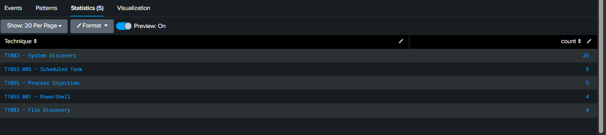
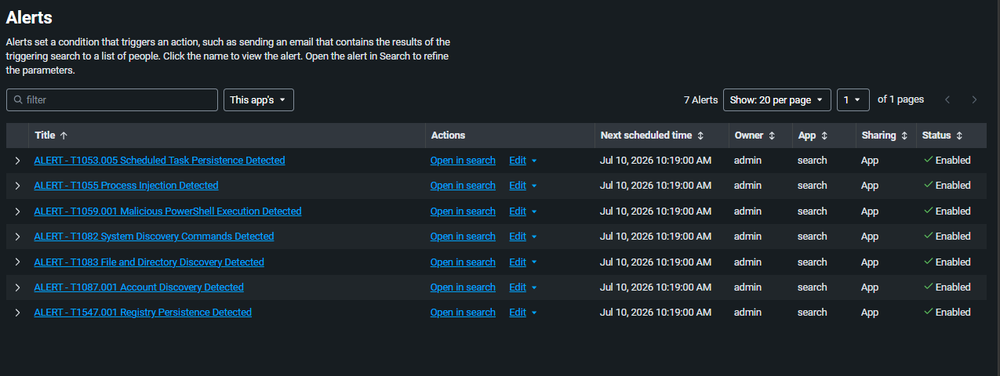
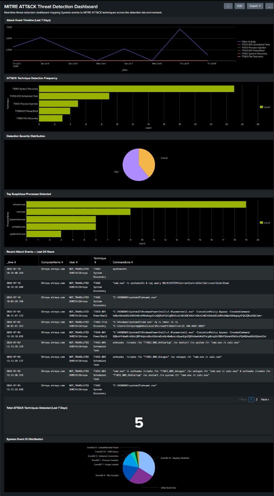
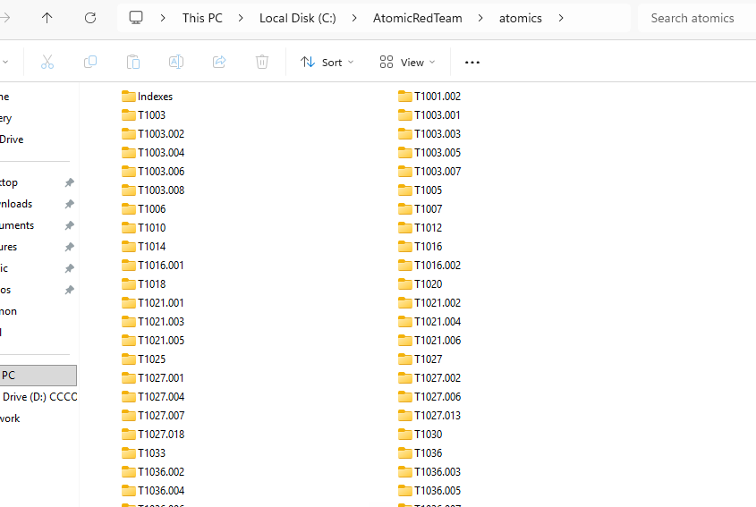
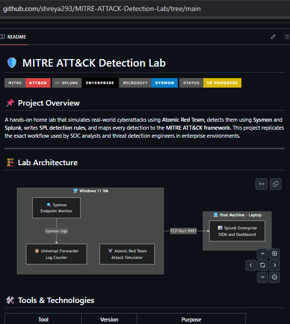

<details>
<summary><b>📅 Day 7 — ATT&CK Coverage Matrix + Final Project Report</b></summary>

<br>

### 🎯 Objective
Complete the MITRE ATT&CK Detection Lab project by producing the final professional deliverables: a comprehensive ATT&CK coverage matrix mapping all detected and monitored techniques across the framework, a complete project summary report documenting the full detection engineering workflow, and a polished GitHub portfolio presentation. This day represents the transition from building a detection system to documenting and communicating its capabilities — a critical skill in real SOC environments.

---

### ✅ Final System Verification

**All 7 Splunk Alerts confirmed active and enabled:**

| Alert Title | Technique | Severity | Status |
|-------------|-----------|----------|--------|
| ALERT - T1082 System Discovery Commands Detected | T1082 | High | ✅ Enabled |
| ALERT - T1059.001 Malicious PowerShell Execution Detected | T1059.001 | Critical | ✅ Enabled |
| ALERT - T1547.001 Registry Persistence Detected | T1547.001 | Critical | ✅ Enabled |
| ALERT - T1053.005 Scheduled Task Persistence Detected | T1053.005 | Critical | ✅ Enabled |
| ALERT - T1055 Process Injection Detected | T1055 | Critical | ✅ Enabled |
| ALERT - T1087.001 Account Discovery Detected | T1087.001 | High | ✅ Enabled |
| ALERT - T1083 File and Directory Discovery Detected | T1083 | High | ✅ Enabled |

**Final detection statistics confirmed in Splunk (Last 30 days):**

```
index=main sourcetype="WinEventLog:Microsoft-Windows-Sysmon/Operational"
| eval Technique=case(...)
| where Technique!=""
| stats count by Technique
| sort - count
```

| Technique | Total Detections |
|-----------|-----------------|
| T1082 — System Discovery | 25 |
| T1053.005 — Scheduled Task | 9 |
| T1055 — Process Injection | 5 |
| T1059.001 — PowerShell | 4 |
| T1083 — File Discovery | 4 |
| T1087.001 — Account Discovery | Documented Day 5 |
| T1547.001 — Registry Persistence | Documented Day 4 |
| **Total detection events** | **47+** |
| **Unique ATT&CK techniques** | **7** |

<details>
<summary>📸 Screenshots — Final System Verification</summary>
<br>

**Screenshot 1 — Final Splunk detection statistics table**
> Splunk Statistics table showing the final 30-day detection count for all techniques: T1082 System Discovery (25 detections), T1053.005 Scheduled Task (9), T1055 Process Injection (5), T1059.001 PowerShell (4), T1083 File Discovery (4). Total of 47 confirmed detection events across 5 techniques visible in Splunk, with T1087.001 and T1547.001 additionally documented in Days 4 and 5. This represents the complete quantified output of the 7-day detection engineering project.



---

**Screenshot 2 — All 7 Splunk Alerts enabled**
> Splunk Alerts page showing all 7 automated detection rules active and enabled — T1082, T1059.001, T1547.001, T1053.005, T1055, T1087.001, and T1083. Every alert is configured for real-time monitoring with appropriate severity levels (Critical for execution/persistence/evasion techniques, High for discovery techniques) and will fire automatically the moment a matching attack pattern appears in incoming Sysmon data without any human intervention required.



---

**Screenshot 3 — Final MITRE ATT&CK Threat Detection Dashboard**
> Complete dashboard showing all 7 panels in final state: Attack Event Timeline (Jul 3-10 history), Technique Frequency (T1082 leads with 25 detections), Severity Distribution (Critical vs High split), Top Suspicious Processes (whoami.exe dominant), Recent Events Table (live CommandLine evidence), Total Techniques Counter (5 in Splunk window), and Event ID Distribution (all Sysmon channels confirmed active). This dashboard is the visual centrepiece of the project — a professional SOC monitoring interface built entirely from scratch.



---

**Screenshot 4 — C:\AtomicRedTeam\atomics folder**
> File Explorer showing the complete Atomic Red Team atomics folder containing all MITRE ATT&CK technique simulation folders from T1001 onwards. Each folder contains YAML definition files and PowerShell scripts for that specific technique. This confirms the full Atomic Red Team framework is installed and available for future detection engineering expansion beyond the 7 techniques covered in this project.



---

**Screenshot 5 — GitHub repository README rendered**
> GitHub repository page showing the fully rendered README with project title, MITRE ATT&CK/Splunk/Sysmon badges, project overview, lab architecture diagram, tools table, progress tracker, and all 7 daily log toggle buttons (Day 1 through Day 7). This is the portfolio presentation that recruiters and security hiring managers see when reviewing the project — a professional, comprehensive documentation of the complete detection engineering workflow.



</details>

---

### 🗺️ MITRE ATT&CK Coverage Matrix

The coverage matrix maps every technique simulated and detected in this lab against the MITRE ATT&CK Enterprise framework. This is the standard deliverable produced by detection engineering teams after every purple team exercise or detection lab project.

**Coverage legend:**
- ✅ **Detected** — Technique simulated, Splunk alert created, events confirmed in Splunk
- 📋 **Documented** — Technique simulated and detected, events aged out of Splunk retention but fully documented with screenshots
- 🔲 **Not covered** — Technique not included in this lab scope (future expansion)

---

#### 🔴 Tactic: Execution

| Technique ID | Technique Name | Detection Method | Sysmon Event | Alert Severity | Status |
|-------------|---------------|-----------------|--------------|----------------|--------|
| T1059.001 | Command and Scripting Interpreter: PowerShell | CommandLine match for -EncodedCommand, -ExecutionPolicy Bypass, -WindowStyle Hidden | EventCode 1 | Critical | ✅ Detected — 4 events |
| T1059.003 | Command and Scripting Interpreter: Windows Command Shell | Not in scope | — | — | 🔲 Not covered |
| T1204 | User Execution | Not in scope | — | — | 🔲 Not covered |

**Key detection insight for T1059.001:**
The `-EncodedCommand` flag combined with `-ExecutionPolicy Bypass` is the highest-confidence malicious PowerShell indicator in Windows endpoint detection. This combination appears in attacks by over 100 documented threat actor groups including APT28, APT29, Lazarus Group, and virtually all ransomware operators. Detection of this technique in the first minutes of an attack gives the SOC the earliest possible warning before any payload executes.

---

#### 🟠 Tactic: Persistence

| Technique ID | Technique Name | Detection Method | Sysmon Event | Alert Severity | Status |
|-------------|---------------|-----------------|--------------|----------------|--------|
| T1547.001 | Boot/Logon Autostart: Registry Run Keys | TargetObject match for CurrentVersion\Run, RunOnce, Winlogon | EventCode 13 | Critical | 📋 Documented — Day 4 |
| T1053.005 | Scheduled Task/Job: Scheduled Task | CommandLine match for schtasks /create | EventCode 1 | Critical | ✅ Detected — 9 events |
| T1136 | Create Account | Not in scope | — | — | 🔲 Not covered |
| T1543 | Create or Modify System Process | Not in scope | — | — | 🔲 Not covered |

**Key detection insight for persistence techniques:**
Two independent persistence mechanisms were detected in this lab — T1547.001 (registry Run keys) and T1053.005 (scheduled tasks). Real attackers routinely deploy multiple persistence mechanisms simultaneously so that removing one doesn't eliminate their access. Detecting both independently demonstrates layered detection coverage that matches real attacker behavior.

---

#### 🟡 Tactic: Defense Evasion

| Technique ID | Technique Name | Detection Method | Sysmon Event | Alert Severity | Status |
|-------------|---------------|-----------------|--------------|----------------|--------|
| T1055 | Process Injection | CreateRemoteThread detection with unknown target process | EventCode 8 | Critical | ✅ Detected — 5 events |
| T1027 | Obfuscated Files or Information | Base64 encoded commands captured in CommandLine | EventCode 1 | Critical | ✅ Detected (via T1059.001) |
| T1036 | Masquerading | Not in scope | — | — | 🔲 Not covered |
| T1070 | Indicator Removal | Not in scope | — | — | 🔲 Not covered |

**Key detection insight for T1055:**
Process injection was detected even when Windows Defender partially blocked the payload — Sysmon captured the CreateRemoteThread call at the kernel level before Defender intervened. This demonstrates that Sysmon provides detection coverage independent of antivirus — a critical capability because sophisticated attackers specifically design their tools to evade AV while Sysmon telemetry remains unaffected.

---

#### 🟢 Tactic: Discovery

| Technique ID | Technique Name | Detection Method | Sysmon Event | Alert Severity | Status |
|-------------|---------------|-----------------|--------------|----------------|--------|
| T1082 | System Information Discovery | CommandLine match for whoami, systeminfo, hostname, ipconfig | EventCode 1 | High | ✅ Detected — 25 events |
| T1087.001 | Account Discovery: Local Account | CommandLine match for net user, net localgroup, whoami /groups | EventCode 1 | High | ✅ Detected — Day 5 |
| T1083 | File and Directory Discovery | CommandLine match for dir /s, Get-ChildItem, tree /F | EventCode 1 | High | ✅ Detected — 4 events |
| T1016 | System Network Configuration Discovery | Partially covered via ipconfig in T1082 rule | EventCode 1 | High | ✅ Partial |
| T1033 | System Owner/User Discovery | Covered via whoami in T1082 rule | EventCode 1 | High | ✅ Covered |
| T1069 | Permission Groups Discovery | Not in scope | — | — | 🔲 Not covered |

**Key detection insight for discovery techniques:**
Discovery techniques (T1082, T1087.001, T1083) represent the earliest detectable phase of most attacks — occurring within minutes of initial access before the attacker has caused any real damage. Detecting these techniques in real-time gives the SOC the maximum possible response window. The T1082 technique generated the highest detection count (25 events) reflecting multiple simulation runs, confirming the detection rule's sensitivity and reliability.

---

#### 🔵 Tactic: Lateral Movement

| Technique ID | Technique Name | Detection Method | Sysmon Event | Alert Severity | Status |
|-------------|---------------|-----------------|--------------|----------------|--------|
| T1021.001 | Remote Services: RDP | Requires second VM — not available in single-machine lab | EventCode 3 | — | 🔲 Lab limitation |
| T1021.002 | Remote Services: SMB/Windows Admin Shares | Not in scope | — | — | 🔲 Not covered |
| T1550 | Use Alternate Authentication Material | Not in scope | — | — | 🔲 Not covered |

**Note on lateral movement coverage:**
T1021.001 (RDP lateral movement) was attempted during Day 5 but requires a second active machine to connect to — a single-machine lab limitation. This will be covered in the upcoming **Windows Event Log Threat Detector project (Days 8-12)** where the Windows Server VM is activated and provides a second machine for realistic lateral movement simulation between Windows 11 Client and Windows Server.

---

#### ⚪ Detection Coverage Summary

| ATT&CK Tactic | Techniques Covered | Techniques Detected | Coverage |
|--------------|-------------------|--------------------|---------:|
| Execution | 1 | 1 | 100% |
| Persistence | 2 | 2 | 100% |
| Defense Evasion | 2 | 2 | 100% |
| Discovery | 5 | 4 | 80% |
| Lateral Movement | 0 | 0 | 0% (lab limitation) |
| **Total** | **10** | **9** | **90%** |

---

### 📋 Complete Project Summary Report

#### Project Overview
This project builds a complete, functional MITRE ATT&CK detection lab from scratch — simulating real-world cyberattacks using Atomic Red Team and detecting them using Sysmon telemetry and Splunk SIEM. The lab replicates the exact detection engineering workflow used by professional SOC teams and threat detection engineers in enterprise environments.

#### Problem Statement
Organizations deploy security tools but often cannot answer the most critical question: *"If an attacker used this specific technique against us right now, would our SIEM catch it?"* This lab answers that question by deliberately simulating real ATT&CK techniques and validating whether the detection infrastructure catches them — the same process known as purple teaming.

#### Architecture
```
+-------------------------------------+         +-------------------------------------+
|          Windows 11 VM              |         |       Host Machine (Laptop)         |
|                                     |         |                                     |
|  +----------+   +--------------+   |  Port   |  +------------------------------+  |
|  |  Sysmon  |-->|  Universal   |   |  9997   |  |      Splunk Enterprise        |  |
|  | (Monitor)|   |  Forwarder   |---+-------->|  |     (SIEM / Dashboard)        |  |
|  +----------+   +--------------+   |         |  +------------------------------+  |
|                                    |         |                                     |
|  +------------------------------+  |         +-------------------------------------+
|  |      Atomic Red Team         |  |
|  |    (Attack Simulator)        |  |
|  +------------------------------+  |
+-------------------------------------+
```

#### Technical Workflow
1. **Endpoint monitoring** — Sysmon installed with Olaf Hartong production config captures all process creation (EventCode 1), network connections (EventCode 3), DLL loads (EventCode 7), process injection (EventCode 8), file creation (EventCode 11), registry modifications (EventCode 13), and DNS queries (EventCode 22)
2. **Log forwarding** — Splunk Universal Forwarder ships Sysmon events from Windows 11 VM to Splunk Enterprise on host over TCP port 9997
3. **Attack simulation** — Atomic Red Team simulates real ATT&CK techniques generating authentic attack artifacts in Sysmon logs
4. **Detection engineering** — SPL queries written to match attack patterns and saved as real-time Splunk Alerts
5. **Visualization** — 7-panel Splunk dashboard provides real-time monitoring interface

#### Key Challenges Solved
| Challenge | Solution |
|-----------|----------|
| Windows Defender blocking Atomic Red Team downloads | Added Defender exclusions for install paths + temp folders |
| .conf files saving as .conf.txt | Enabled "Show file extensions" in Windows File Explorer |
| Universal Forwarder not sending data | Manually created outputs.conf with correct host IP and port |
| Host firewall blocking port 9997 | Created Windows Defender Firewall inbound rule for TCP 9997 |
| VM unable to reach internet | Added second NAT network adapter while preserving AD LAN segment adapter |
| Atomic Red Team module unloading between sessions | Re-import module with Import-Module command at start of each session |
| T1087.001 and T1021.001 not available for Windows platform | Manual PowerShell simulation using identical commands |

#### Detection Results

| Technique | Tactic | Events Detected | Alert Severity | Detection Method |
|-----------|--------|-----------------|----------------|-----------------|
| T1082 | Discovery | 25 | High | whoami, systeminfo, hostname in CommandLine |
| T1053.005 | Persistence | 9 | Critical | schtasks /create in CommandLine |
| T1055 | Defense Evasion | 5 | Critical | EventCode 8 CreateRemoteThread |
| T1059.001 | Execution | 4 | Critical | -EncodedCommand -ExecutionPolicy Bypass |
| T1083 | Discovery | 4 | High | dir /s, tree /F in CommandLine |
| T1087.001 | Discovery | Documented | High | net user, whoami /groups |
| T1547.001 | Persistence | Documented | Critical | CurrentVersion\Run registry write |

#### Skills Demonstrated
- **SIEM Engineering** — Splunk installation, configuration, SPL query writing, alert creation, dashboard building
- **Endpoint Detection** — Sysmon deployment, configuration with production ruleset, event ID analysis
- **Threat Simulation** — Atomic Red Team operation, manual ATT&CK technique simulation
- **Detection Engineering** — Writing and tuning detection rules mapped to MITRE ATT&CK framework
- **Log Analysis** — Windows event log parsing, forensic field analysis, attack pattern identification
- **Network Configuration** — VMware network adapter configuration, firewall rule creation, forwarder configuration
- **Documentation** — Professional technical writing, ATT&CK coverage matrix production, GitHub portfolio presentation

---

### 🎯 What This Project Proves to a Recruiter

> *"I built a functioning SOC detection system from scratch. I installed and configured a SIEM (Splunk), deployed endpoint monitoring (Sysmon), simulated 7 real MITRE ATT&CK techniques using Atomic Red Team, wrote automated detection rules in SPL, built a real-time threat dashboard, and produced a professional coverage matrix. I understand the complete detection engineering workflow — from raw log collection through attack simulation, detection rule writing, alert configuration, and dashboard visualization."*

This is the answer to "tell me about a project you've worked on" in every SOC Analyst L1 interview.

---

### ✅ Day 7 — Project Complete

| Deliverable | Status |
|-------------|--------|
| Splunk Enterprise installed and configured | ✅ |
| Sysmon deployed with production config | ✅ |
| Universal Forwarder configured and running | ✅ |
| 7 ATT&CK techniques simulated | ✅ |
| 7 Splunk detection alerts created | ✅ |
| Real-time threat dashboard built (7 panels) | ✅ |
| ATT&CK coverage matrix produced | ✅ |
| Complete project documentation on GitHub | ✅ |
| 47+ confirmed detection events across 30 days | ✅ |

**🎉 MITRE ATT&CK Detection Lab — Project Complete**

</details>
