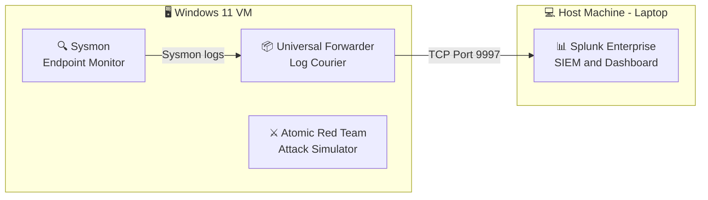

# 🛡️ MITRE ATT&CK Detection Lab

## 📌 Project Overview

A hands-on home lab that simulates real-world cyberattacks using **Atomic Red Team**, detects them using **Sysmon** and **Splunk**, writes **SPL detection rules**, and maps every detection to the **MITRE ATT&CK framework**. This project replicates the exact workflow used by SOC analysts and threat detection engineers in enterprise environments.

---

## 🏗️ Lab Architecture

 

## 🛠️ Tools & Technologies

| Tool | Version | Purpose |
|------|---------|---------|
| Splunk Enterprise | 10.4.0 | SIEM — log collection, search, dashboards |
| Sysmon | Latest (Sysinternals) | Windows endpoint monitoring |
| Splunk Universal Forwarder | 10.4.1 | Log forwarding from VM to Splunk |
| Atomic Red Team | Latest | ATT&CK technique simulation |
| Olaf Hartong Sysmon Config | Master | Production-grade Sysmon ruleset |
| VMware Workstation | — | Virtualization |
| Windows 11 (VM) | x64 | Target endpoint machine |

---

## 📅 Project Progress

| Day | Topic | Status |
|-----|-------|--------|
| Day 1 | Splunk + Sysmon + Universal Forwarder Setup | ✅ Complete |
| Day 2 | SPL Basics + Sysmon Event ID Analysis | ✅ Complete |
| Day 3 | Atomic Red Team Installation + Attack Simulations | ⏳ Pending |
| Day 4 | SPL Detection Rules — Part 1 | ⏳ Pending |
| Day 5 | SPL Detection Rules — Part 2 | ⏳ Pending |
| Day 6 | Splunk Threat Detection Dashboard | ⏳ Pending |
| Day 7 | ATT&CK Coverage Matrix + Final Report | ⏳ Pending |

## 📜 License
This project is for educational purposes. Tools used are free and open-source or free-tier licensed.

## 👩‍💻 Author
**Shreya Singh Chauhan**
- GitHub: [shreya293](https://github.com/shreya293)
- Focus: SOC Analyst L1 | Cybersecurity | Network Security
